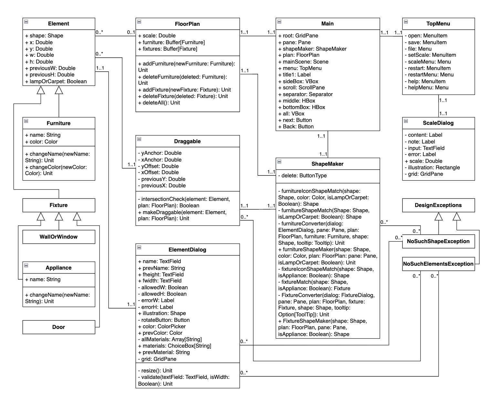

# Interior Design Tool

## General Description

The implemented program is an interior design tool that allows the user to design baesed on an 
imported image of a floor plan or create a new one from scratch.The elements of the apartment 
can be moved and edited after insertion, and the programchecks that they do not overlap. The 
final result can be saved as an image.

When the program starts, the user is presented with a floor plan design view where walls, 
windows, fixtures and doors can be added to the floor plan. From the menus at the top of the screen, 
the user can select an image to use as the floor plan, save the current plan as an image file, set 
the scale of the plan, clear the program's memory and start over, or read the program's quick start 
guide. If the user wants to build the plan themself, they can click on the elements they want, give them 
dimensions, rotate them to the desired orientation at 45° intervals and add them to the floor plan. 
Before adding any element, the user must set the desired scale for the floor plan from the menu.

Once the floor plan is selected or completed, the user can switch to the interior design view with the 
click of a button. The interior design view offers a number of different colours and shapes of 
furniture to choose from to add to the floor plan. Furniture can be added in the same way as other 
elements, but with more options for editing it. In addition to the dimensions, furniture can also 
be given a name, material and colour. With the exception of the shape, all element data can be edited 
afterwards. All furniture can also be rotated.

No element can be added to a floor plan without giving it dimensions. However, it is not mandatory to 
name an element in order to add it. You can give a scale to the floor plan, and all added elements will 
be scaled to this scale. Once an element has been added to the floor plan, it can be dragged with the 
mouse to move it or double-clicked to edit it. You can remove an element from the edit view.

For the most part, the elements must not overlap in the plan. However, to make it easier to build the 
floor plan, walls and windows can overlap. If the floor plan is imported as a picture, the user must 
visually check that the furniture does not overlap the walls and appliances. Carpets or lamps can be 
added to the floor plan in addition to the usual furniture, which may overlap with other furniture. 
In order for carpets to appear under furniture in the interface, they must be added to the floor plan 
before other furniture. For the same reason, lamps must be added last. When the user tries to move 
an element over another, the element will return to its starting point and, if it is a piece of 
furniture, will turn red.

The final result can be saved as an image (jpg or png file). If desired, the user can clear the entire 
layout and scaling and start over from scratch.

## User Interface

Initially the user can use the provided wall, door and appliance components to build their own floorplan 
or import an image they would like to use. When importing an image, the user can set the scale of the 
design to match that of the image to make conceptualizing the size of everything easier. The image 
used for demonstration [1] has no scale reference, so it was estimated based on what seemed accurate.

<figure>
  
  <figcaption>The user can set the scale for the floor plan.</figcaption>
</figure>

The user can move between the side panels displaying the building fixtures and pieces of furniture with the 
"Next" and "Back" buttons, and all the elements can be moved and edited in both views.

<figure>
  
  <figcaption>A design being implemented.</figcaption>
</figure>

Elements can be added to by clicking on the in the side panel and giving them dimensions, after which they 
appear in the top left corner of the design view. The elements added to the design can be moved around the 
floor plan by dragging them with the mouse. Generally, the program does not allow the elements to overlap, 
with exceptions made for wall elements that can overlap each other to make constructing a floor plan easier, 
and specific pieces of furniture that can overlap other furniture. If an element would be placed incorrectly, 
it is returned to its original place, and in the case of pieces of furniture, the item turns red. The original 
color can be restored by opening the editing view and clicking "Apply".

An element that has been added can be modified or deleted by double-clicking on it and selecting the 
desired action from the opened dialog. When editing furniture, the open dialog performs input validation to make sure the element won't crash 
the program.

<figure>
  
  <figcaption>The program won't allow the user to input improper data.</figcaption>
</figure>

If the user chooses to name an element, the element's name is shown when the mouse is hovered over it. 
In other cases, the name displayed is the default "Furniture" or "Appliance".

<figure>
  
  <figcaption>The names of the elements are visible when hovered over.</figcaption>
</figure>

If the user wishes to start over, the "Restart" option is always visible and wipes the current project clean.
If the user needs help, there is a quick guide to using the program from "Help".

## Examples of Finished Designs

<figure>
  
  <figcaption>A finished design can be saved as an image.</figcaption>
</figure>

<figure>
  
  <figcaption>The whole design view is saved when the floor plan is made from scratch.</figcaption>
</figure>

## More Infromation

Run the design tool from Main.

Read more about the project and my process in [Loppuraportti](Loppuraportti.pdf) (Finnish only).

[1] "Figure 1. Sample floor plan image with the specification of different...", ResearchGate. Referenced: 1st February 2025. [Online]. Available: https://www.researchgate.net/figure/Sample-floor-plan-image-with-the-specification-of-different-room-sizes-and-furniture_fig1_356610760